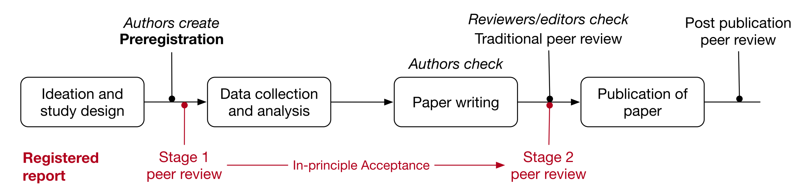

<link href="https://fonts.googleapis.com/css?family=Noto+Sans+TC:300,400,500&display=swap&subset=chinese-traditional" rel="stylesheet"> 

# 心理科學再現危機與因應方案 {data-background="https://cdn.cos.io/media/images/amazon-research-3.original.jpg"}

## 自我介紹

陳紹慶  
慈濟大學人類發展與心理學系專任副教授

 <small>開放科學中心大使</small> 
 
<small>心理科學加速器創始成員；訓練委員會助理監督</small> 
 [<small>scchen.com</small>](http://scchen.com)

  <small>[Fork my slides on Github](https://github.com/SCgeeker/Talk_PsyCrisis)</small>

# 2011: First year of Replication Crisis in Psycho

## Diederik Stapel

<small>Diederik Stapel</small>

Exposed by 3 junior researchers @ TU

Investigated by 3 universities

58 papers retracted

10 PhD dissertations were polluted

## Daryl Bem's Feeling the Future

{width=60%}
<small>Daryl Bem</small>

{ width=150% }

## False-positive psychology

----

----

<small>Chris Chambers</small>

{ width=70% }

## Today I will talk about...

- The Sin of Bias
- The Sin of Hidden Flexibility
- The Sin of Unreliability
- The Sin of Corruptibility

# The Sin of Bias

## What is False-Positive

|||
|---|---|

## Prevalence of False-Positive 

|<small>Fanelli(2010)</small>|<small>Fanelli(2012)</small>|
|:---:|:---:|
|||

----

**If we wish every result is replicable, a science at least has the statistical power of 80%.**

## The truth is ... [(Smaldino and McElreath, 2016)](https://doi.org/10.1098/rsos.160384)

{width=150%}

----

----

# The sin of Hidden Flexibility

## Controversy surrounding Power Posing 

<small>Amy Cuddy @ TED talk</small>

**Take two minutes, you will...**

| Boost self-confidence |
| --- |
| Intention to take risks |
| More Testosterone |
| Less Cortisone |

----

**Good theory, Bad evidence**

- Failed replications (Ranehill, 2015)
- Publication bias (Carney, Cuddy, & Yap, 2015; Simmons & Simonsohn, 2017)
- Sloopy methods: **p-hacking(Cherry picking)** and **HARKing** (Bailey, LaFrance, & Dovidio, 2017; Cesario, Jonas, & Carney, 2017; Gronau et al., 2017; Jonas et al., 2017; Klaschinski, Schnabel, & Schröder-Abé, 2017; Latu, Duffy, Pardal, & Alger, 2017; Ronay, Tybur, van Huijstee, & Morssinkhof, 2016) 
- Till present, there is a reproducible but slight **feeling of power**.

----

<small>Amy Cuddy @ TED talk</small>

**Take two minutes, you will...**

| Boost self-confidence | true positive but tiny effect |
| --- | --- |
| Intention to take risks | false positive |
| More Testosterone | false positive |
| Less Cortisone | false positive |

## When we focus on positive results only...

{width=70%}

# The sin of Unreliability

## What\'s wrong with Daryl Bem\'s study

{width=60%}
<small>Daryl Bem</small>

{ width=150% }

----

Source: https://youtu.be/42QuXLucH3Q

----

Source: https://youtu.be/42QuXLucH3Q

----

## Criticisms

JPSP rejected failed replication([Ritchie, Wiseman, & French, 2012](http://journals.plos.org/plosone/article?id=10.1371/journal.pone.0033423#s5))

**HARKing** (Hypothesizing After the Results are Known; Kerr, 1998)

----

{width=90%}

# The sin of Corruptibility

## A Discredited Food Psychologist

- PI of Cornell Food and Brand Lab (2005-2018)
- 2007 IG Nobel Prize: [bottomless bowls study](https://onlinelibrary.wiley.com/doi/full/10.1038/oby.2005.12)
- Author of **Mindless Eating**(2005) and Slim by Design(2014)
- Smater Lunchrooms Project (NIFA funded, since 2012)
- **Till Sep. 2018, 22 papers retracted and 15 corrected.**

----

**Wansink boasted how to publish paper by QRPs**

{width=50%}    
<small>(Original date: [2016/11/21](https://web.archive.org/web/20170312041524/http:/www.brianwansink.com/phd-advice/the-grad-student-who-never-said-no)) </small>

----

**[GRIM](https://peerj.com/preprints/2064/)**: A tool to check the spooky roundings of scaling data, less than 100 samples.

|  |  |  | {width=30%} |
|:---:|:---:|:---:|:---:|
|James Heathers|Nick Brown|Jordan Anaya|Tim van der Zee|

----

4 Wansink-boasted papers had QRPs:  

----

## [Retractions before Wansink\'s resign](https://en.wikipedia.org/wiki/Brian_Wansink#Further_corrections_and_retractions)

## More truth to be revealed

- 2007 Ig Nobel: [Wansink, Painter, and North (2005); bottomless bowls study](https://onlinelibrary.wiley.com/doi/full/10.1038/oby.2005.12)

- [Audit by James Heathers](https://medium.com/@jamesheathers/sprite-case-study-5-sunset-for-souper-man-ee898b6af9f5)

- No further investigation since Wansink claimed his resignment.

#

{width=90%}

# Solution: 7 steps to Open Science

----

## [實踐研究過程透明化七步驟](https://osf.io/hktmf/)

1. 在公開存放庫創建研究專案預置空間
2. 研究專案[預先註冊](https://youtu.be/jStcWBSeKUA)(Preregistration);或投稿[註冊報告](https://cos.io/rr/)(Registered Report)
3. 開放研究材料(Open Materials)
4. 開放研究資料(Open Data)
5. 開放可重製程式碼(Reproducible Code, Open Source)
6. 開放取用(Open Access): 同儕審稿前於**預印本平台**公開手稿，接受後依版權協議公開全文。
7. 開放同儕審稿(Open Peer Review)

# 

|[{width=33%}](https://osf.io/)|||
|:---:|:---:|:---:|
|[使用指南](https://scchen.com/zh/post/open-science-framework.zh/)|||

# 

||
|---|

## 預先註冊是什麼？

- 研究開始執行前註記備份日期的計劃文件。

- 計劃文件詳述到完成發表前，執行細節的行動標準、紀錄方式及公開管道。
{width=70%}

## 預先註冊與註冊報告

## 接受註冊報告的期刊

- COS[介紹專頁](https://cos.io/rr/)及[公開表格](https://docs.google.com/spreadsheets/d/1D4_k-8C_UENTRtbPzXfhjEyu3BfLxdOsn9j-otrO870/edit#gid=0)；目前全球各領域已超過200本期刊接受一般或特定目的的註冊報告。

- 中華心理學刊也接受註冊報告；目前投稿狀況未知。

## 如何進行？

<iframe  width="420" height="345" src="https://www.youtube.com/embed/jStcWBSeKUA" data-autoplay></iframe>

## 常見的誤會

- 公開紀錄會侵犯參與者個人隱私嗎？
  - 紀錄只限能重製分析結果的資訊，未在分析計劃之內的無關或非必要之個人隱私資料，研究者原則上不必亦不得收集。

- 公開的計畫書會被其他學者搶先完成嗎？
  - 只要是以預先註冊/註冊報告模式完成的計劃，必須檢核是否依照開始前的計劃執行。公開計劃的研究者在完成計劃之前，有該項計劃的著作權。

#

|||{width=60%}|
|---|---|---|

## 公開存放庫一站達成

<small>範例：[物件方向效應跨語言量測專案](https://osf.io/e428p/)</small>

## 報告整合公開資訊

<small>範例：[探討物件尺寸調節物件方向效應之機制](https://psyarxiv.com/a3vwc/)</small>

## 報告數據可重製

{width=60%}

#

|{width=70%}|
|:---:|

----

- (未)公開的OSF備份計劃或報告文件，可直接於[OSFpreprints](https://osf.io/preprints/)公開。

- 逐次更新，確保計劃到報告的累進紀錄一致。

- **建置平台易，養成習慣難**，需要整個學術界同意為規範(Norms)。

## OA在台灣學術界的推廣難題

- 掠奪性期刊泛濫
- 正確資訊不易觸及所有學者

# 

|)||
|---|---|

## 正在運作的同儕評審系統

{width=70%}

<small>來源：[episciences.org](https://www.episciences.org/)</small>

## 正在萌芽的新創企業

# 如何開始?

## 機構支持

----

|[{width=33%}](https://openscience-utrecht.com/) [{width=20%}](https://osf.io/3qrj6/)|[{width=60%}](https://osf.io/wfc6u/) [{width=60%}](https://psysciacc.org/)|
|:---:|:---:|
|開放科學社群|協作平台|

----

{width=50%}